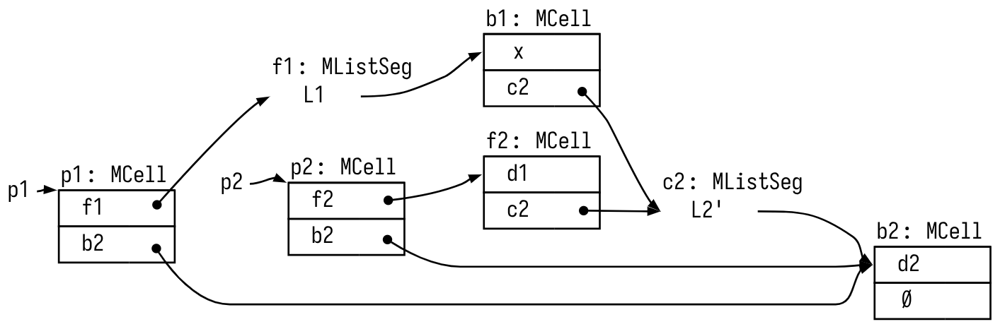

# Sepviz

A library for visualizing and animating separation-logic formulas as memory diagrams.  This repo contains:

- [sepviz](./sepviz): The visualization library, written in TypeScript. It parses separation-logic formulas from Rocq goal strings, renders them using [Graphviz](https://graphviz.org/), and animates them using [d3](https://d3js.org/).

- [sepviz-alectryon](./sepviz-alectryon): Glue code to use Sepviz with [Alectryon](https://github.com/cpitclaudel/alectryon).

- [sepviz-vsrocq](./sepviz-vsrocq): A fork of the VSRocq IDE to visualize and animate separation logic proofs while writing them.

- [interop](./interop): Rocq notations allowing Sepviz to understand many [CFML](https://github.com/charguer/cfml), [SLF](https://softwarefoundations.cis.upenn.edu/slf-current/index.html), and [Iris](https://iris-project.org/) formulae.

- [examples](./examples): Examples of integration with CFML, SLF, and Iris.

This library works with Coq 8.20.1 (most of the separation-logic libraries that we target have not yet been ported to Rocq 9):

- Use `make init` to {OPAM,npm,pip} dependencies, then `make all` to build everything.
- Use `make serve` and browse to `localhost:8080` to view generated examples.
