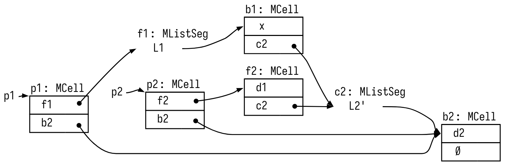

# Sepviz



A library for visualizing and animating separation-logic formulas as memory diagrams.  This repo contains:

- [sepviz](./sepviz): The visualization library, written in TypeScript. It parses separation-logic formulas from Rocq goal strings, renders them using [Graphviz](https://graphviz.org/), and animates them using [d3](https://d3js.org/).

- [sepviz-alectryon](./sepviz-alectryon): Glue code to use Sepviz with [Alectryon](https://github.com/cpitclaudel/alectryon).

- [sepviz-vsrocq](./sepviz-vsrocq): A fork of the VSRocq IDE to visualize and animate separation logic proofs while writing them.

- [interop](./interop): Rocq notations allowing Sepviz to understand many [CFML](https://github.com/charguer/cfml), [SLF](https://softwarefoundations.cis.upenn.edu/slf-current/index.html), and [Iris](https://iris-project.org/) formulae.

- [examples](./examples): Examples of integration with CFML, SLF, and Iris.

## Building the repo

The main branch works with Coq 8.20.1, as not all of the separation-logic libraries that we target have been ported to Rocq 9):

- Use `make init` to {OPAM,npm,pip} dependencies, then `make all` to build everything.
- Use `make serve` and browse to `localhost:8080` to view generated examples.

## Installing framework integrations

The framework-specific interoperability packages can be installed separately.

### `sepviz-iris`

For Coq versions 8.20.1 or later, but earlier than Rocq 9.0, with Iris 4.3.0 or later, install from the main branch:
```bash
opam pin add -n sepviz-iris.dev https://github.com/epfl-systemf/sepviz.git --subpath=interop/sepviz-iris
opam install sepviz-iris.dev
```

For Rocq 9.0.1 or later, install from the `rocq-9.0.1` branch:
```bash
opam pin add -n sepviz-iris.dev https://github.com/epfl-systemf/sepviz.git\#rocq-9.0.1 --subpath=interop/sepviz-iris
opam install sepviz-iris.dev
```

### `sepviz-cfml` and `sepviz-slf`

For Coq versions 8.20.1 or later, but earlier than Rocq 9.0, replace `<framework>` with either `cfml` or `slf`:
```bash
opam pin add -n sepviz-<framework>.dev https://github.com/epfl-systemf/sepviz.git --subpath=interop/sepviz-<framework>
opam install sepviz-<framework>.dev
```

## Reading about the code

- [Yawen Guan, Shardul Chiplunkar, and Clément Pit-Claudel. 2026. Automatic Heap-Memory Diagrams for Separation-Logic Proofs. To appear in Computer Aided Verification: 38th International Conference, CAV 2026.](https://yawen.me/assets/sepviz.pdf)
